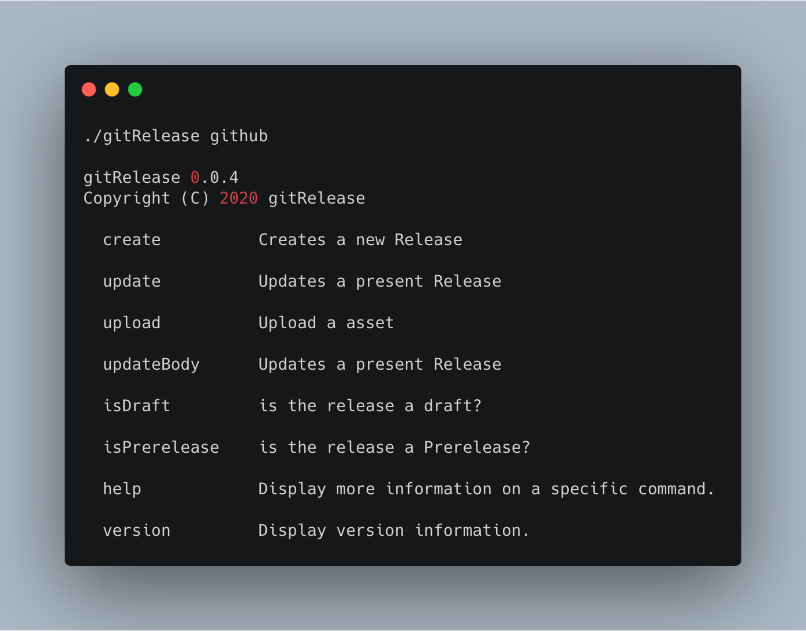
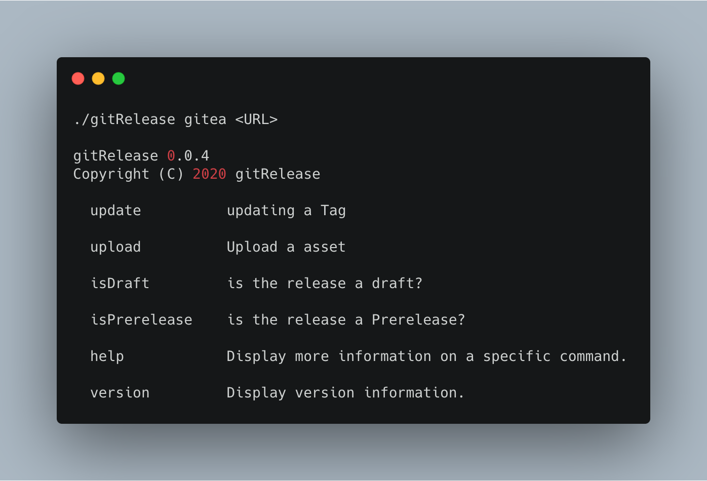

# gitRelease [](https://jenkins.craftingit.de/job/kstruessmann(GitHub)/job/gitRelease/job/master/)

gitRelease ist ein .net Core Consolen Program, welches verwendet werden kann um in Verschiedenen CI Systemen Releases zu erstellen oder zu bearbeiten. Aktuell wird GitHub und Gitea als Api Entpunkt unterstützt.

## Usage

### Github
 

### Gitea
 

## CLI Download 

Latest Releases for windows, linux and MacOS [here](https://github.com/kstruessmann/gitRelease/releases) 

## Docker [](https://hub.docker.com/r/craftingit/gitrelease)   

```sh
  docker pull craftingit/gitrelease:latest
```

## Nuget [](https://www.nuget.org/packages/gitRelease/)

```sh
  dotnet tool install --global gitRelease 
``` 
